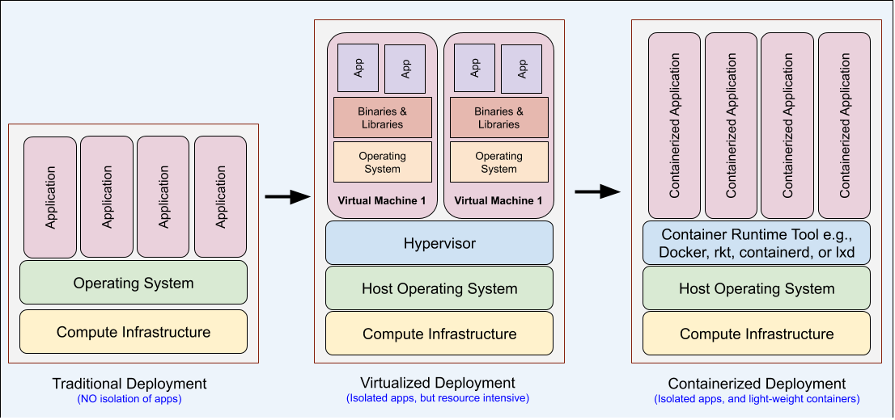

# Udagram Microservices Project 
Udagram is a simple cloud application developed alongside the Udacity Cloud Engineering Nanodegree. It allows users to register and log into a web client, post photos to the feed, and process photos using an image filtering microservice.

The project is split into three parts:
1. [The Simple Frontend](/udacity-c3-frontend)
A basic Ionic client web application which consumes the RestAPI Backend. 
2. [The RestAPI Feed Backend](/udacity-c3-restapi-feed), a Node-Express feed microservice.
3. [The RestAPI User Backend](/udacity-c3-restapi-user), a Node-Express user microservice.

#### Udagram microservices project, I have setup my development environment on AWS EC2 interface. Reason for doing so is I have windows home edition system and finding it challanging to do the setup for docker and kubernetes on it. Also it add a bit of additional complexity to project, but it help me to learn a lot about the AWS ecosystem and understanding about the different components. My Udagram frontend is deployed on S3 bucket and other rest apis on the EC2 interface. Please find the following steps for the project development instructions.

## Setting up Udagram Microservice Dev Environment on AWS EC2
### Task-01 Installing GIT on AWS EC2
Commands :
1. Perform a quick update on your instance:
   sudo yum update -y
2. #Install git in your EC2 instance
   sudo yum install git -y 
3. #Check git version
   git version

### Task-02 Install node version manager (nvm) by typing the following at the command line.
1. curl -o- https://raw.githubusercontent.com/nvm-sh/nvm/v0.34.0/install.sh | bash
2. Activate nvm by typing the following at the command line.
   . ~/.nvm/nvm.sh 
3. Use nvm to install the latest version of Node.js by typing the following at the command line. Installing Node.js also installs the  
   Node Package Manager (npm) so you can install additional modules as needed.
   nvm install node
4. Test that Node.js is installed and running correctly by typing the following at the command line.
   node -e "console.log('Running Node.js ' + process.version)"

### Task-03 Install the Ionic CLI
1.  npm install -g @ionic/cli

### Task-04 install python3 on AWS
1. sudo yum install python3

### Task-05 Check installations
1. node --version
2. npm --version
3. ionic --version

### Task-06 GIT Clone Repo
Current repo [Clone the project repo]

### Task-07 Command to build and run project
1. npm install
2. npm install bcrypt
3. source ~/.bash_profile
4. npm run dev

### Task-08 - Problem connecting to postgress database on AWS from EC2 instance
1. Check the username/password.
2. Security Groups while creating RDS -Postgress, allocate default security group which does not have permission for inbound and 
   outbound traffic. Need to update the same.

### Task-09 Installing Dockers on AWS EC2 Linux instance (Docker Installation)
1. Create EC2 with Amazon Linux AMI (Linux version should be > 2.2.14)
2. Login to your EC2 with PuTTY
3. Do an update of Amzon Linux
   * "sudo yum update"
4. Now for installing docker run below command:
   * "sudo yum install -y docker"
5. Give permission
   * "sudo usermod -a -G docker ec2-user"
6. Start Docker Service
   * "sudo service docker start"
7. Run below command to get docker service up automatically after reboot:
   * "sudo chkconfig docker on"
8. Optionally, create a new user for Docker management and add him to Docker (default) group
   * "useradd dockeradmin"
   * "passwd dockeradmin"
   * "usermod -aG docker dockeradmin"
9. Once you have Docker installed, open a terminal and run:
   * "docker run alpine echo hello world"
10. Congratulations! You are now running Docker!

### Task-10 Converting the monolithic application to microservices: (Dockerizing the services) - Done
1. Create a project folder in your local computer and clone the following Git repository -
   https://github.com/udacity/nd9990-c3-microservices-v1
2. Create your Dockerfile
3. Build the Image for the "user" service
   * docker build -t <your_dockerhub_username_lowercase>/udacity-restapi-user .
4. Build the image for the "feed" service
   * docker build -t <your_dockerhub_username_lowercase>/udacity-restapi-feed . 
5. Build the image for the "frontend" service
   * docker build -t <your_dockerhub_username_lowercase>/udacity-frontend . 
6. Optional Step : If you face any errors, please need to update the Angular dependencies. Try to update them before building the image 
   as follows:
   * sudo npm install -g @angular/cli@latest
   * sudo ng update --all --force
   * docker build -t <your_dockerhub_username_lowercase>/udacity-frontend . 
7. If you want to remove any image, use the following commands:
   * docker image rm -f <image_name/ID>
   * docker image prune
8. ### Dockerizing the services (Commands)
   sudo docker run --rm --publish 8103:8103 -v $HOME/.aws:/root/.aws --env POSTGRESS_HOST=$POSTGRESS_HOST --env  
   POSTGRESS_USERNAME=$POSTGRESS_USERNAME --env POSTGRESS_PASSWORD=$POSTGRESS_PASSWORD --env POSTGRESS_DB=$POSTGRESS_DB --env    
   AWS_REGION=$AWS_REGION --env AWS_PROFILE=$AWS_PROFILE --env AWS_BUCKET=$AWS_BUCKET --env JWT_SECRET=$JWT_SECRET --name feed4 
   amitgoswami1027/udacity-restapi-feed
9. Docker Compose Installation
   * sudo curl -L https://github.com/docker/compose/releases/download/1.21.0/docker-compose-$(uname -s)-$(uname -m) -o /usr/local/bin/docker-compose
   * After you do the curl command , it'll put docker-compose into the : /usr/local/bin
   * sudo ln -s /usr/local/bin/docker-compose /usr/bin/docker-compose
   * which docker-compose
   * sudo /home/your-user/your-path-to-compose/docker-compose up
   
sudo chmod +x /usr/local/bin/docker-compose
### Important Commands used during the setup on AWS EC2. 
1. Set Pythons path : /usr/bin/python3
2. npm install node-pre-gyp -g
3. npm config set python /usr/bin/python3
4. node-gyp --python /usr/bin/python3
5. sudo yum install /usr/bin/g++
npm install sequelize
npm install sequelize-typescript
npm i sequelize@latest --save 
npm i sequelize-typescript@latest --save
6. npm ci
7. Setting Environment variables for the microservices in ~/.bash_profile file
   export POSTGRESS_USERNAME=myusername;
   export POSTGRESS_PASSWORD=mypassword;
   export POSTGRESS_DB=postgres;
   export POSTGRESS_HOST=udagramdemo.abc4def.us-east-2.rds.amazonaws.com;
   export AWS_REGION=us-east-2;
   export AWS_PROFILE=default;
   export AWS_BUCKET=udagramdemo;
   export JWT_SECRET=helloworld;
8. source ~/.bash_profile
9. Run your Container (simplified version)
   docker run --publish 8080:8080 --name feed <your_dockerhub_username_lowercase>/udacity-restapi-feed
10. Run your Container (working version) - Dockerizing the services
    docker run --rm --publish 8080:8080 -v $HOME/.aws:/root/.aws --env POSTGRESS_HOST=$POSTGRESS_HOST --env 
    POSTGRESS_USERNAME=$POSTGRESS_USERNAME --env POSTGRESS_PASSWORD=$POSTGRESS_PASSWORD --env POSTGRESS_DB=$POSTGRESS_DB --env 
    AWS_REGION=$AWS_REGION --env AWS_PROFILE=$AWS_PROFILE --env AWS_BUCKET=$AWS_BUCKET --env JWT_SECRET=$JWT_SECRET --name feed 
    <your_dockerhub_username_lowercase>/udacity-restapi-feed
11. Verify the Running Container
    curl http://localhost:8080/api/v0/feed
    docker container ls
    docker container kill <container_name>
    docker container prune
12. Check The Logs
    docker logs feed
    docker logs feed --follow
    docker logs feed --tail 3
13. Debugging Inside The Container
    docker exec -it feed bash
14. Pushing the images to dockerhub
    docker push yourdockerhubname/udacity-restapi-feed 

### Dockerfile (Basics) 
a text file without any extension that contains all the commands to be executed to generate an image.
#### FROM (a Dockerfile must begin with a FROM instruction . initializes a new build stage sets the base image for subsequent instructions)
#### RUN (command to create and start containers using the current image commits the results so that the resulting committed image will be used for the next step in the Dockerfile.)
#### WORKDIR (creates (if not exists) and set the working directory for any RUN, CMD, ENTRYPOINT, COPY and ADD instructions that follow it in the Dockerfile.)
#### COPY(copies new files or directories from <src> and adds them to the filesystem of the container at the path <dest>)
#### EXPOSE (specify the network ports of the container at runtime specify the network protocol that the port listens (TCP is the default) NOTE: EXPOSE does not actually publish the port -- it functions more as a documentation tool
#### CMD (provide defaults for an executing container if the defaults do not include an executable, you must specify an ENTRYPOINT
NOTE: there can be only one CMD instruction in a Dockerfile)

# KUBERNETES( K8s) - Installation on AWS EC2 Instance
Kubernetes (K8s) is an Apache 2.0-licensed open source Container Orchestration tool for effectively managing containerized applications.
Kubernetes can automate the deployments, maintaining a logical group of containers, and helps to scale the application services. Google started it, but many other companies like Docker, Red Hat, and VMware contributed to it. In 2016, Google transferred the IP rights to Cloud Native Computing Foundation(CNCF. 

## Why do we need Kubernetes?


The above image shows the containerized applications have the advantage of being lightweight and more comfortable to manage, as compared to Virtual Machine (VM) based deployment.  Kubernetes can help in managing containerized application in the following ways:
* Manage Containers - Self-healing such as auto-restart of a backup/replica container in case of a failure, automate the rollouts and rollbacks, configuration management of containers
* Autoscale Workloads and Load balancing - Distributing a load of network traffic to suitable container/node
* Optimal Resource Utilization - Each container has its own resource (CPU and memory) requirements. Kubernetes fits a container to the 
 most suitable Node so that the resources of the Node are utilized effectively.
* Service Discovery - Provide native methods for service discovery
* Storage orchestration - Automatically mounting the volumes to containers
* Others - Fire off jobs and scheduled cronjobs, quickly integrate and support 3rd party apps, and manage Stateless and Stateful applications

## How does Kubernetes work?
A Kubernetes deployment follows the “Master-Worker” model. We need to understand the key components before we look into the architecture diagram.

* Node - A physical or virtual machine that runs multiple containers belonging to an application.
* Cluster - A set of Master and Worker Nodes. When we deploy Kubernetes, we get a cluster, which each cluster has a minimum of one worker node. A master node is capable of managing multiple worker nodes.
* Master Node - A node that decides the pod scheduling, and pod replication. The main components of a master node are - “kube-api-server”, “kube-scheduler”, “kube-controller”.
* Worker Node - A node on which pods are scheduled and run.
* Pod - A group of tightly coupled containers with shared storage, network, and a specification for how to run the containers. All the containers in a Pod are co-located and co-scheduled. The worker node(s) hosts the pods.


In the above diagram, the following elements are involved:
* kubelet - a “node agent” using which the worker node communicates with the master node. The kubelet runs on each Node.
* kube-proxy - a “node agent” using which the worker node communicates with the external world. The kube-proxy also runs on each Node.
* kube-apiserver - the frontend API that exposes the Kubernetes control plane.
* etcd - a key-value store to stores the cluster state
* kube-scheduler - a component that schedules the pods for running on the most suitable Node.
* kube-controller-manager - a component that bundles and runs controller processes. These processes concern the nodes, replication,  
 endpoints, and access management.

### Kubeone installation [https://github.com/kubermatic/kubeone] - [Done]
1. It is recommended to use KubeOne for Linux users. kubeone is a CLI tool and a Go library for installing, managing, and upgrading 
   Kubernetes High-Available (HA) clusters. It can be used on any cloud provider, on-prem or bare-metal cluster.

### Task-01: Downloading a binary from GitHub Releases - [Done]
    *  curl -LO https://github.com/kubermatic/kubeone/releases/download/v<version>/kubeone_<version>_<operating_system>_amd64.zip
    *  Find the releases from : [https://github.com/kubermatic/kubeone/releases]
    *  Example: "curl -LO https://github.com/kubermatic/kubeone/releases/download/v0.11.1/kubeone_0.11.1_linux_amd64.zip"
2. Extract the binary to the KubeOne directory. On Linux and macOS, you can use unzip.
    * "unzip kubeone_<version>_<operating_system>_amd64.zip -d kubeone_<version>_<operating_system>_amd64"
    *  Example : "unzip kubeone_0.11.1_linux_amd64.zip -d kubeone_0.11.1_linux_amd64"
3. Move the kubeone binary to your path, so you can easily invoke it from your terminal.
    * "sudo mv kubeone_<version>_<operating_system>_amd64/kubeone /usr/local/bin"
    *  Example : "sudo mv kubeone_0.11.1_linux_amd64/kubeone /usr/local/bin"
4. Kubeone installation done

### Task-02: Terraform Instalaltion - [Done]
5. Home Brew : [/bin/bash -c "$(curl -fsSL https://raw.githubusercontent.com/Homebrew/install/master/install.sh)"]
   brew install terraform
   Set brew to PATH
   brew install gcc
6. For compilers to find isl@0.18 you may need to set:
   * export LDFLAGS="-L/home/linuxbrew/.linuxbrew/opt/isl@0.18/lib"
   * export CPPFLAGS="-I/home/linuxbrew/.linuxbrew/opt/isl@0.18/include"
   For pkg-config to find isl@0.18 you may need to set:
   * export PKG_CONFIG_PATH="/home/linuxbrew/.linuxbrew/opt/isl@0.18/lib/pkgconfig"
7. Install Terraform (terraform Successfully Installed)
   brew install terraform
   Go to kubeone_0.11.1_linux_amd64/examples/terraform/aws
   terraform init
9. AWS Credentials: 
   export AWS_ACCESS_KEY_ID=
   export AWS_SECRET_ACCESS_KEY=

### Task-03: Install kubectl on Linux - [Done]
1. Download the latest release with the command:
   curl -LO https://storage.googleapis.com/kubernetes-release/release/`curl -s https://storage.googleapis.com/kubernetes-release/release/stable.txt`/bin/linux/amd64/kubectl
2. To download a specific version, replace the
   curl -s https://storage.googleapis.com/kubernetes-release/release/stable.txt
3. For example, to download version v1.18.0 on Linux, type:
   curl -LO https://storage.googleapis.com/kubernetes-release/release/v1.18.0/bin/linux/amd64/kubectl
4. Make the kubectl binary executable.
   chmod +x ./kubectl
5. Move the binary in to your PATH.
   sudo mv ./kubectl /usr/local/bin/kubectl
6. Test to ensure the version you installed is up-to-date:
   kubectl version --client
   https://github.com/kubermatic/kubeone/blob/master/docs/quickstart-aws.md

### Task-04: One we install KubeOne and Kubectl on the AWS EC2 instance,do the following steps: 
1. Setup Credentials - Create IAM account and store the AWS_ACCESS_KEY_ID and AWS_SECRET_ACCESS_KEY environment variables in your AWS 
   EC2 instance
2. Create Infrastructure - Associate the required compute resources to create the Kubernetes cluster.
3. Install Kubernetes Upon successful installation, run kubectl get nodes command. 

## Task-05 Setting Up a Kubernetes Cluster on AWS in 5 Minutes
### (I was facing some challanges while installing kubectl" using kubeone. Instead I am using KOPS to install kubeclt on AWS EC2 instance). Here goes the steps to do the same.....

Kubernetes is like magic. It is a system for working with containerized applications: deployment, scaling, management, service discovery, magic. Think Docker at scale with little hassle. 

### Step-01 : Before setting up the Kubernetes cluster, you’ll need an AWS account and an installation of the AWS Command Line Interface. "aws configure"
Install Home Brew : /bin/bash -c "$(curl -fsSL https://raw.githubusercontent.com/Homebrew/install/master/install.sh)"
 echo 'eval $(/home/linuxbrew/.linuxbrew/bin/brew shellenv)' >> /home/ec2-user/.bash_profile
### Step-02 : Installing kops + kubectl
 * brew update && brew install kops kubectl
### Step-03 : Setting Up the Kubernetes Cluster
 *  The first thing we need to do is create an S3 bucket for kops to use to store the state of the Kubernetes cluster and its 
    configuration. We’ll use the bucket name udagram-kops-goswami-store
    * sudo aws s3api create-bucket --bucket udagram-kops-goswami-store --region us-east-1
 *  After creating the udagram-kops-goswami-store, let’s enable versioning to revert or recover a previous state store.
    * sudo aws s3api put-bucket-versioning --bucket udagram-kops-goswami-store --versioning-configuration Status=Enabled
 *  Before creating the cluster, let’s set two environment variables: KOPS_CLUSTER_NAME and KOPS_STATE_STORE. For safe keeping you 
    should add the following to your ~/.bash_profile
    * export KOPS_CLUSTER_NAME=udagram-kops-goswami-store.k8s.local
    * export KOPS_STATE_STORE=s3://udagram-kops-goswami-store
 *  You don’t HAVE TO set the environment variables, but they are useful and referenced by kops commands. For example, see kops create 
    cluster --help. If the the Kubernetes cluster name ends with k8s.local, Kubernetes will create a gossip-based cluster.
 *  Now, to generate the cluster configuration:
    * kops create cluster --node-count=2 --node-size=t2.medium --zones=us-east-1a
 *  kops create secret --name udagram-kops-goswami-store.k8s.local sshpublickey admin -i ~/.ssh/authorized_keys
 *  kops create cluster --node-count=2 --node-size=t2.medium --zones=us-east-1a --name udagram-cluster
 *  Time to build the cluster. This takes a few minutes to boot the EC2 instances and download the Kubernetes components.
    * kops update cluster --name ${KOPS_CLUSTER_NAME} --yes
 *  After waiting a bit, let’s validate the cluster to ensure the master + 2 nodes have launched.
    * kops validate cluster
 *  Finally, you can see your Kubernetes nodes with kubectl:
    * kubectl get nodes
 *  kubectl cluster-info
 *  With this hostname, open your browser to https://api-udagram-kops-goswami-store-k8s-local-71cb48-202595039.us-east-1.elb.amazonaws.com/ui. (You’ll need to replace the hostname with yours).
 *  Alternatively, you can access the Dashboard UI via a proxy:
    * kubectl proxy
 *  Delete the Kubernetes Cluster
    kops delete cluster --name ${KOPS_CLUSTER_NAME} --yes
 #### [https://ramhiser.com/post/2018-05-20-setting-up-a-kubernetes-cluster-on-aws-in-5-minutes/]

Suggestions:
 * validate cluster: kops validate cluster
 * list nodes: kubectl get nodes --show-labels
 * ssh to the master: ssh -i ~/.ssh/id_rsa admin@api.udagram-kops-goswami.k8s.local
 * the admin user is specific to Debian. If not using Debian please use the appropriate user based on your OS.
 * read about installing addons at: https://github.com/kubernetes/kops/blob/master/docs/operations/addons.md.
https://github.com/makinwab/microservice-project-udacity

## Task-06 Kubernetes dashboard.
Kubernetes Dashboard is a general purpose, web-based UI for Kubernetes clusters. It allows users to manage applications running in the cluster and troubleshoot them, as well as manage the cluster itself.
* To deploy Dashboard, execute following command:
  * kubectl apply -f https://raw.githubusercontent.com/kubernetes/dashboard/v2.0.0-rc7/aio/deploy/recommended.yaml
* kubectl proxy
  * 

### What is POD?
A pod is a "logical-grouping" of tightly coupled containers (one or more) that have shared storage, a network, and a standard specification. The worker node(s) hosts one or more pods at a time. The image below shows a pod having two containers running in a host.


The set of containers within a pod have the following essential characteristics:
1. Share the same namespace (IP address and ports), storage, and network.
2. Can communicate within the set using localhost
3. Will always be scheduled together to run on a host node as a single entity * (co-scheduled) & (co-located). If a container is shut 
   down/added/removed, then the pod has to "restart". Here, the "pod restart" means to restart the environment the containers run in.
4. Run a single instance of the containerized application. 

* [Controller] : A Controller helps to manage multiple pods each running an individual instance of the application.
Assume there are multiple pods, each running an individual instance of the application. Such a set of identical pods is called ReplicaSet. The ReplicaSet (of pods) ensures the high-availability of the services hosted inside them. ReplicaSets are created and managed by Controller.

The Controller specifies the necessary attributes and state of Pods and ReplicaSets in a .yaml configuration file, which is called Deployment. This configuration file provides declarative updates to manage Pods and ReplicaSets. The Controller can manage the situations, such as when the host (worker-node) fails, or the pod scheduling is interrupted, using the "Deployment" configuration file. In such cases, the Controller automatically replaces the pod by scheduling an identical replacement on a different node.

* [Pod Templates]: The Controller uses another .yaml configuration file called "Pod Template". It contains the pod specifications such as name, count of replicas, containers to run, port, and many other details.

### K8s Deployments
Controller specifies the necessary attributes and state of Pods and ReplicaSets in a .yaml configuration file, which is called Deployment. This configuration file provides declarative updates to create and manage Pods / ReplicaSets. We define a Deployment to:
1. Create new Pods or ReplicaSets
2. delete the existing Deployments, thereby releasing the compute resources occupied by them

A Deployment contains the details about the containers that would comprise the Pods / ReplicaSets. The figure below shows a sample deployment file in which “kind”, “replicas”, “image”, and “labels” fields are highlighted.

### K8s Deployment template


### K8s Deployment Flow


### K8s Rolling Update


### K8s Deployment must read
[https://kubernetes.io/docs/concepts/workloads/controllers/deployment/]

### Deployment Configuration Files
* kubectl apply -f backend-feed-deployment.yaml 
* kubectl apply -f backend-user-deployment.yaml 
* kubectl apply -f frontend-deployment.yaml 
* kubectl apply -f reverseproxy-deployment.yaml
* kubectl apply -f pod-example/pod.yaml
* kubectl get pod -o wide

* Labels : Labels are "tags" in the form of key/value pairs that are associated with Kubernetes objects (Deployments/Pods). Multiple 
  objects may belong to a single Label. Labeling helps to identify all the objects (and resources) associated with a particular Label   
  value (say "Production" or "Testing"). Applying a Label does not have any impact on the behavior of the underlying object. They are 
  helpful in better organizing the objects (and resources).


### AWS EKS (Elastic Kubernetes Service) - Must Read.
* EKS [https://aws.amazon.com/eks/]
* AWS Service mesh [https://aws.amazon.com/app-mesh/]

## K8s Service Registeration, Discovery and Autoscaling
Kubernetes has an integrated pattern for decoupling configuration from application or container. This pattern makes use of two Kubernetes components: ConfigMaps and Secrets.
### ConfigMap
Externalized data stored within kubernetes.
* Can be referenced through several different means:
* environment variable
* a command line argument (via env var) injected as a file into a volume mount. Can be created from a manifest, literals, directories, or files directly.

### Secret
* Functionally identical to a ConfigMap.
* Stored as base64 encoded content.
* Encrypted at rest within etcd (if configured!).
* Ideal for username/passwords, certificates or other sensitive information that should not be stored in a container.Can be created from 
  a manifest, literals, directories, or from files directly.

Secrets and ConfigMaps both follow key-value pair styles to store information. Both the files have .yaml extension. The main difference is that the Secrets store the values in the base64 encoded format. Secret allows us to store confidential information, such as passwords, OAuth tokens, and SSH keys. A pod can use a Secret in either of the following two ways:
* As files in a volume mounted on its containers
* Kubelet uses secrets while pulling images for the pod
* So, let us learn to encode and decode given String(s) into base64 encoding format.

### Kubernetes Services Types
There are 4 major service types:
1. ClusterIP (default)
2. NodePort
3. LoadBalancer
4. ExternalName

### Scaling a Deployment
kubectl scale deployment/user --replicas=10


# CI/CD (Continuous Integration & Continuous Delivery)
CI/CD is one of the best practices followed in the DevOps model. 

# What is DevOps?
DevOps is the combination of industry best practices, and set of tools that improves an organization’s ability to:
* Increase the speed of software delivery.
* Increases the speed of software evolution.
* Have better reliability of the software.
* Have scalability using automation.
* Improved collaboration among teams.

### Continuous Integration means newly developed code changes of a project are regularly built, tested, and merged to a shared repository like git.
### Continuous Delivery is the process of automating the release of the merged and validated code to a repository and finally release a production-ready build to the production environment.

### CI System Example


# Udagram Image Filtering Microservice

Udagram is a simple cloud application developed alongside the Udacity Cloud Engineering Nanodegree. It allows users to register and log into a web client, post photos to the feed, and process photos using an image filtering microservice.

The project is split into three parts:
1. [The Simple Frontend](/udacity-c3-frontend)
A basic Ionic client web application which consumes the RestAPI Backend. 
2. [The RestAPI Feed Backend](/udacity-c3-restapi-feed), a Node-Express feed microservice.
3. [The RestAPI User Backend](/udacity-c3-restapi-user), a Node-Express user microservice.

## Getting Setup

> _tip_: this frontend is designed to work with the RestAPI backends). It is recommended you stand up the backend first, test using Postman, and then the frontend should integrate.

### Installing Node and NPM
This project depends on Nodejs and Node Package Manager (NPM). Before continuing, you must download and install Node (NPM is included) from [https://nodejs.com/en/download](https://nodejs.org/en/download/).

### Installing Ionic Cli
The Ionic Command Line Interface is required to serve and build the frontend. Instructions for installing the CLI can be found in the [Ionic Framework Docs](https://ionicframework.com/docs/installation/cli).

### Installing project dependencies

This project uses NPM to manage software dependencies. NPM Relies on the package.json file located in the root of this repository. After cloning, open your terminal and run:
```bash
npm install
```
>_tip_: **npm i** is shorthand for **npm install**

### Setup Backend Node Environment
You'll need to create a new node server. Open a new terminal within the project directory and run:
1. Initialize a new project: `npm init`
2. Install express: `npm i express --save`
3. Install typescript dependencies: `npm i ts-node-dev tslint typescript  @types/bluebird @types/express @types/node --save-dev`
4. Look at the `package.json` file from the RestAPI repo and copy the `scripts` block into the auto-generated `package.json` in this project. This will allow you to use shorthand commands like `npm run dev`


### Configure The Backend Endpoint
Ionic uses enviornment files located in `./src/enviornments/enviornment.*.ts` to load configuration variables at runtime. By default `environment.ts` is used for development and `enviornment.prod.ts` is used for produciton. The `apiHost` variable should be set to your server url either locally or in the cloud.

***
### Running the Development Server
Ionic CLI provides an easy to use development server to run and autoreload the frontend. This allows you to make quick changes and see them in real time in your browser. To run the development server, open terminal and run:

```bash
ionic serve
```

### Building the Static Frontend Files
Ionic CLI can build the frontend into static HTML/CSS/JavaScript files. These files can be uploaded to a host to be consumed by users on the web. Build artifacts are located in `./www`. To build from source, open terminal and run:
```bash
ionic build
```
***
